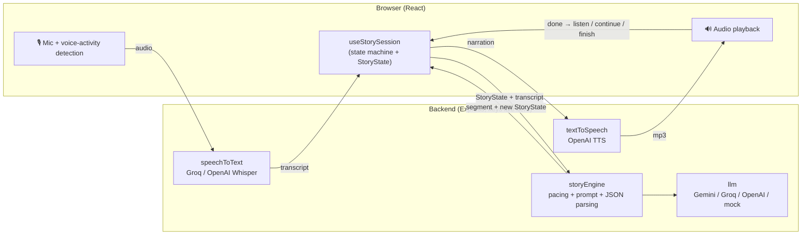

# 🌙 TeddyAI

A voice-first, interactive bedtime storytelling app for kids that helps parents stay part of bedtime even when they can't be there to read.

> **This should feel like a bedtime experience powered by voice, not a chatbot that happens to speak.**

Built for the Hiya Voice AI Challenge. Full build spec: [`docs/spec.md`](docs/spec.md).

---

## 1. Product overview

1. **The parent sets up tonight's story** (≈30 seconds): child's name, age, interests, story length, and optionally something private on the child's mind ("nervous about starting school tomorrow").
2. **The parent hands over the device.** The child sees a dark screen with one glowing moon.
3. **The child just talks.** "Tell me a story about a cat that goes to space." Teddy narrates it aloud, occasionally offers a choice ("the blue door or the silver door?"), and accepts interruptions ("wait, make Cosmo purple!").
4. **The story winds down by design.** Choices stop, narration slows, the screen dims, and the story ends peacefully with "Goodnight."

## 2. The problem

Parents who work late, travel, or are caring for another child miss bedtime stories. Recorded audiobooks aren't personal, and a generic chatbot is built to *keep kids engaged*, which is the opposite of what bedtime needs. TeddyAI lets the parent shape tonight's story (their child, their interests, what's on their mind) while the child gets a story that responds to them and then gently lets them fall asleep.

## 3. Why voice

- The room is dark and the child is lying down. Eyes should be closed, not on a screen.
- Young children can't type, and many can't read yet.
- Talking keeps the child *inside* the story instead of operating an app.
- Voice also makes the wind-down possible: the voice itself slows and softens, and the child can simply stop answering.

After the setup screen, nothing requires reading. Every state is conveyed by the moon's animation and the narrator's voice.

## 4. Architecture



**The voice loop** (`frontend/src/hooks/useStorySession.ts`):

```
READY ─tap─▶ LISTENING ─speech─▶ THINKING ─▶ SPEAKING ─┬─ asked a question ─▶ LISTENING
                                     ▲                  ├─ no question ──────▶ THINKING (auto-continue)
                                     │                  └─ story finished ───▶ FINISHED
              tap while SPEAKING = interrupt ─▶ LISTENING
```

- Listening stops automatically when the child stops talking (a small volume-based voice-activity detector in `services/listen.ts`). If the story asked a question and the child stays quiet, **the story continues on its own** instead of nagging, because a quiet child may be falling asleep.
- The **backend is stateless**. The browser holds `StoryState` and sends it with each turn, and the backend returns an updated copy. A failed request never corrupts the story: the old state is reused on retry, and backend restarts don't lose sessions.

### Project structure

```
shared/types.ts                 StoryState + API types used by both sides
backend/src/
  index.ts                      Express app; serves the built frontend in production
  config.ts                     Reads .env, auto-selects providers from available keys
  routes/  story.ts speech.ts voice.ts
  models/storyState.ts          Initial state, pacing/phase logic, applying updates (pure functions)
  prompts/bedtimeStoryPrompt.ts System prompt + per-turn prompt builder
  services/
    storyEngine.ts              StoryState + transcript -> segment + new state; JSON validation
    llm.ts                      Provider wrapper (Gemini, OpenAI-compatible) via fetch
    speechToText.ts             Whisper-style transcription
    textToSpeech.ts             Narration audio, calmer delivery per phase
    mockStory.ts                Offline scripted storyteller (same JSON shape as the LLM)
frontend/src/
  pages/        Setup.tsx Story.tsx
  components/   MicrophoneButton VoiceStatus StoryDisplay StoryMemoryPanel
  hooks/        useStorySession.ts   the voice loop
  services/     api.ts listen.ts narrator.ts
```

## 5. Technology choices

| Piece | Choice | Why |
|---|---|---|
| Frontend | React + TypeScript + Vite, plain CSS | Fast to build, no UI framework needed for two screens |
| Backend | Node + Express (TypeScript, run with `tsx`) | One language end-to-end; StoryState types shared directly |
| Story LLM | **Groq `openai/gpt-oss-120b`** (free tier), auto-fallback to **Gemini 3.5 Flash** | ~1 s per segment in testing; Gemini free tier was often overloaded (503s), so it is the backup |
| Speech-to-text | **Groq Whisper large-v3-turbo** (free tier) | Very fast, accurate; Chrome Web Speech API as a no-key fallback |
| Text-to-speech | **OpenAI `gpt-4o-mini-tts`** (optional, paid) | Warm voice that accepts delivery instructions ("slower, softer…"); browser voices as a free fallback |
| Provider SDKs | None (plain `fetch`) | Fewer dependencies; each provider is ~20 lines and easy to swap |

## 6. Local setup

Requires Node 20.12+ (developed on Node 24). Use Chrome for the best microphone support.

```bash
npm install
cp .env.example .env        # then paste in your keys (see below)
npm run dev                 # backend on :8787, frontend on http://localhost:5173
```

Open http://localhost:5173, click **"Fill in demo"**, then **Start Bedtime Story**, and tap the moon.

**No keys yet?** It still runs: the story engine falls back to an offline scripted story (`mock`), speech recognition uses Chrome's built-in Web Speech API, and narration uses the browser's built-in voices.

**Production / deploy:** `npm run build && npm start` serves the built frontend and API from one Express process on `PORT`. It works on any Node host (Render, Railway, Fly). Set the same env vars there. Microphone access requires HTTPS (or localhost).

## 7. Environment variables

| Variable | Required? | Purpose |
|---|---|---|
| `GEMINI_API_KEY` | Recommended (free) | Backup story engine. Get at https://aistudio.google.com/apikey |
| `GROQ_API_KEY` | Recommended (free) | Main story engine + speech-to-text (Whisper). Get at https://console.groq.com/keys |
| `OPENAI_API_KEY` | Optional (paid) | High-quality narration voice (~10–15¢ per 8-min story) |
| `LLM_PROVIDER` | Optional | `gemini` \| `groq` \| `openai` \| `mock`. Auto-selected from keys if blank |
| `LLM_MODEL` | Optional | Override the default model |
| `STT_PROVIDER` | Optional | `groq` \| `openai` \| `browser` |
| `TTS_PROVIDER` | Optional | `openai` \| `browser` |
| `TTS_VOICE` | Optional | OpenAI voice name (default `sage`) |
| `PORT` | Optional | Backend port (default `8787`) |

The backend logs which provider is active for each step on startup. Keys never reach the browser: every AI call goes through `/api/*`.

## 8. How StoryState works

`StoryState` (`shared/types.ts`) is the story's memory, updated every turn:

- **child**: name, age, interests
- **parentGoal**: private context that shapes themes and is never spoken
- **story**: title, characters *with current traits* (`"Cosmo — a curious cat, now purple"`), setting, running summary, current scene, important events, **childChanges** (every change the child requested, kept for the rest of the story), and the last narration (so an interruption can resume mid-thought)
- **pacing**: target duration, estimated elapsed minutes, phase, segment count, words narrated, segments since the last question
- **interactionCount**, **finished**

Each turn, `storyEngine.ts` sends the model the full memory plus the child's words, and asks for strict JSON:

```json
{ "narration": "...", "title": "...", "characters": ["..."], "setting": "...", "summary": "...",
  "currentScene": "...", "importantEvent": "...", "childChange": "Cosmo is purple", "askForResponse": true }
```

The reply is parsed tolerantly (strips code fences, extracts the outer `{…}`, validates each field). If the model returns plain prose, it's still used as narration. A failed parse is retried once. If the turn still fails, the UI offers a retry and the story state is untouched.

Open **"Story memory (for grown-ups)"** on the story screen to watch the state update live. It's useful in a demo.

## 9. How Wind Down Mode works

Most conversational AI optimizes for engagement. Teddy follows the opposite curve: **engage → immerse → calm → disengage → sleep.**

**The code controls pacing, not the model** (`backend/src/models/storyState.ts`):

- Elapsed time is estimated from words narrated (~130 wpm bedtime pace) plus ~15 s per child interaction.
- The phase comes from progress through the requested length, and it only ever moves forward:

| Progress | Phase | Behavior |
|---|---|---|
| 0–35% | Interactive | Short segments (50–90 words), choices allowed every other segment |
| 35–65% | Settling | Longer, calmer narration; at most one question every ~3 segments |
| 65–90% | Wind down | No questions (enforced server-side), soothing imagery, conflicts resolve |
| 90%+ | Ending | Hero goes home to bed; clear "The end. Goodnight." The story is marked finished |

- `askForResponse` is **forced to false** in late phases even if the model asks, and there's a hard segment cap, so the story can never run forever.
- The **voice** slows down too: TTS delivery instructions (and browser speech rate) get softer and slower each phase.
- The **screen** dims and every animation slows as the phase advances.
- A child who stops answering isn't prompted again. The story simply continues and ends.

## 10. Safety

- The system prompt forbids violence, frightening imagery, threatening villains, sexual content, drugs, insults, and dangerous behavior, and keeps conflicts small and resolvable.
- Inappropriate requests are **playfully redirected** ("a monster? This one was a fluffy cloud monster who only wanted a hug") rather than refused or scolded.
- The parent's goal is shaped into the narrative and never revealed ("your mom told me…" is explicitly prohibited).
- Provider-side safety filters apply on top.
- Privacy: audio is held in memory only for the transcription request and never stored. There is no database and no accounts. Story state lives in the browser tab.

## 11. Current limitations

- Interruption is **tap-to-interrupt**, not hands-free barge-in. Voice-detecting speech while the narrator talks would need echo handling.
- Elapsed time is an estimate from word counts, not wall-clock time.
- Turns are request/response (no streaming), so there's a ~2–5 s "Thinking…" pause between segments.
- The volume-based voice detector can be fooled by loud background noise. Tapping the moon always ends listening manually.
- Browser speech recognition fallback works only in Chrome. Browser TTS voices vary by OS.
- Gemini's free tier may use requests to improve Google's products, which isn't appropriate for a production children's app (use a paid tier or another provider).
- The offline `mock` story is scripted and only loosely responds to the child.

## 12. Future improvements

- **Parent voice messages**: the story ends with the real parent's recorded "Goodnight Mia, I love you."
- **Consented parent-voice narration**, with careful consent and security design.
- **Streaming + prefetch**: stream LLM text into TTS sentence-by-sentence and prefetch the next segment during playback to remove the pause.
- **Hands-free barge-in** using echo cancellation and voice-activity detection during narration.
- **Story memory across nights**: "Yesterday Luna discovered the Moon Garden…"
- **Parent dashboard** with privacy-conscious summaries, not transcripts.
- **Multiple child profiles**, and a bedtime routine: story → breathing exercise → calm sounds → goodnight.
- **Gentle vocal adaptation** (pace/energy, not emotion inference): calmer narration for a restless child.

Privacy principles for production: delete raw audio after transcription, store summaries rather than conversations, give parents explicit control and clear retention, and never advertise based on children's conversations.
