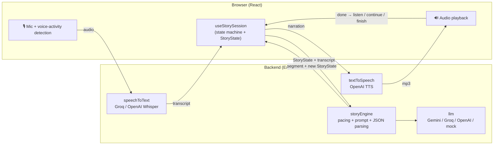

# 🌙 TeddyAI

A voice-first, interactive bedtime storytelling app for kids that helps parents stay part of bedtime even when they can't be there to read.

> **This should feel like a bedtime experience powered by voice, not a chatbot that happens to speak.**

Built for the Hiya Voice AI Challenge. Full build spec: [`docs/spec.md`](docs/spec.md).

---

## 1. Product overview

1. **The parent sets up tonight's story** (≈30 seconds the first time, two taps after that): child's name, age, interests, story length, and optionally something private on the child's mind ("nervous about starting school tomorrow"). Each child is saved as a profile on the device, so siblings are one tap away, and tapping several children makes **one shared story**: written for the youngest one's level, mixing everyone's interests, with Teddy asking each child by name in turn. Story length is a 1–15 minute slider (1-minute stories are handy for testing).
2. **The parent hands over the device.** The child sees a dark screen with Teddy, a friendly bear whose face shows what's happening: ears perk up while listening, mouth moves while talking, eyes grow heavy as the story winds down, and Teddy falls asleep at the end. A sidebar shows which child the story is for, and switches to a sibling in one tap.
3. **The child just talks.** "Tell me a story about a cat that goes to space." Teddy narrates it aloud, occasionally offers a choice ("the blue door or the silver door?"), and accepts interruptions ("wait, make Cosmo purple!"), replying like a person would ("Ooh! A purple cat? I love that!") before carrying on. To interrupt, the child can tap Teddy or just say **"Teddy!"**: narration stops, Teddy says "Yes?", and listens. Vocabulary, sentence length, and plot complexity adapt to the child's age.
4. **The story winds down by design.** Choices stop, narration slows, the screen dims, and the story ends peacefully with "Goodnight." The child can say "I'm done" or "I'm sleepy", or a grown-up can tap **Finish story**, and Teddy wraps up with a gentle ending instead of stopping mid-sentence.

## 2. The problem

Parents who work late, travel, or are caring for another child miss bedtime stories. Recorded audiobooks aren't personal, and a generic chatbot is built to *keep kids engaged*, which is the opposite of what bedtime needs. TeddyAI lets the parent shape tonight's story (their child, their interests, what's on their mind) while the child gets a story that responds to them and then gently lets them fall asleep.

## 3. Why voice

- The room is dark and the child is lying down. Eyes should be closed, not on a screen.
- Young children can't type, and many can't read yet.
- Talking keeps the child *inside* the story instead of operating an app.
- Voice also makes the wind-down possible: the voice itself slows and softens, and the child can simply stop answering.

After the setup screen, nothing requires reading. Every state is conveyed by Teddy's face and the narrator's voice, and the child can interrupt without touching the screen by calling Teddy's name.

### Designed for children who can't read

Most children who need a bedtime story can't read yet, so **anything the child needs to know is said out loud**, not just shown on screen. Text on the story screen is only for the grown-up.

| Moment | What the child hears / sees |
|---|---|
| Story screen opens | Teddy greets them by name and asks what the story should be about, suggesting their own interests: *"Hi Mia! I'm Teddy, and I'm going to tell you a bedtime story. What should it be about? Maybe space, or cats? Or anything you like!"* Then it listens on its own; no tap needed. If the parent typed a story idea, Teddy announces it and starts instead. |
| Child's turn to talk | A soft rising "ding-ding" chime, and Teddy's ears perk up and move with their voice. |
| Teddy heard them | A falling "ding-ding", then an instant spoken reaction ("Ooh, good one!") while the story is written. |
| First answer | Teddy teaches the one rule that matters: *"…if you want to tell me something during the story, just say, Teddy!"* |
| Child stays quiet at the start | *"That's okay! I'll pick a story for you."* |
| Teddy couldn't hear them | *"Hmm, I didn't catch that. Can you say it again?"* After a second miss: *"That's okay! Let's keep going with our story."* No error screen. |
| Story engine hiccup | One quiet automatic retry first. Only if that fails: *"Oops, my story got a little tangled. A grown-up can help me try again."* (the grown-up sees a retry button). |
| Talking / thinking / sleepy / finished | Teddy's mouth moves; it tilts its head and looks up; eyes grow heavy in Wind Down; it falls asleep with floating z's at the end. |

Problems only a grown-up can fix (microphone permission blocked) are shown as text. And the microphone permission prompt appears when the **parent** presses Start, not later in the child's hands. All of Teddy's non-story lines live in `frontend/src/services/teddyLines.ts`; the chimes are generated with Web Audio in `frontend/src/services/chime.ts` (no audio files).

**Ideas not built yet:**
- **The parent's own voice for the greeting**: the parent records "Hi Mia, Teddy's going to tell you a story tonight. I love you!" once, and it plays at the start (no voice cloning needed).
- **A first-time practice round**: the very first time a child uses Teddy, a 20-second game ("Can you say *Teddy*? Great! That's how you talk to me").
- **Picture choices for the youngest**: when Teddy offers a choice, show two big pictures the child can tap (helpful for 2–3 year olds who don't answer out loud yet).
- **Adaptive patience**: wait longer for younger children to answer, and re-ask more simply ("Blue door, or silver door?") if they seem unsure.
- **A sound signature for each state**: a soft page-turn sound when the story continues and a lullaby tone when Wind Down begins, so the change in pace is felt, not read.

## 4. Architecture



**The voice loop** (`frontend/src/hooks/useStorySession.ts`):

```
READY ─tap─▶ LISTENING ─speech─▶ THINKING ─▶ SPEAKING ─┬─ asked a question ─▶ LISTENING
                                     ▲                  ├─ no question ──────▶ THINKING (auto-continue)
                                     │                  └─ story finished ───▶ FINISHED
              tap while SPEAKING = interrupt ─▶ LISTENING
```

- Listening stops automatically when the child stops talking (a small volume-based voice-activity detector in `services/listen.ts`). If the story asked a question and the child stays quiet, **the story continues on its own** instead of nagging, because a quiet child may be falling asleep.
- **Responsiveness** (a young child's attention span is short): narration audio *streams*, so Teddy starts talking ~1 s after the text is ready instead of waiting 5–30 s for a whole segment; the moment the child's words are understood Teddy says a quick "Ooh!" (cached clips) while the story is written; and while a segment without a question plays, the next one is fetched in the background. Measured: the "Ooh!" comes ~1 s after the child stops talking, and the story resumes ~3.5 s after.
- **Voice fallback:** if the OpenAI voice fails (expired key, no credits, offline), the screen shows "Switching to the default voice", the same part is replayed with the browser's built-in voice, and the server stops using OpenAI for new stories when the key or credits are the problem.
- The **backend is stateless**. The browser holds `StoryState` and sends it with each turn, and the backend returns an updated copy. A failed request never corrupts the story: the old state is reused on retry, and backend restarts don't lose sessions.

### Project structure

```
shared/types.ts                 StoryState + API types used by both sides
backend/src/
  index.ts                      Express app; serves the built frontend in production
  config.ts                     Reads .env, auto-selects providers from available keys
  routes/  story.ts speech.ts voice.ts
  models/storyState.ts          Initial state, pacing/phase logic, applying updates (pure functions)
  prompts/bedtimeStoryPrompt.ts System prompt + per-turn prompt builder
  services/
    storyEngine.ts              StoryState + transcript -> segment + new state; JSON validation
    llm.ts                      Provider wrapper (Gemini, OpenAI-compatible) via fetch
    speechToText.ts             Whisper-style transcription
    textToSpeech.ts             Narration audio, calmer delivery per phase
    mockStory.ts                Offline scripted storyteller (same JSON shape as the LLM)
frontend/src/
  pages/        Setup.tsx Story.tsx
  components/   MicrophoneButton VoiceStatus StoryDisplay StoryMemoryPanel
  hooks/        useStorySession.ts   the voice loop
  services/     api.ts listen.ts narrator.ts
```

## 5. Technology choices

| Piece | Choice | Why |
|---|---|---|
| Frontend | React + TypeScript + Vite, plain CSS | Fast to build, no UI framework needed for two screens |
| Backend | Node + Express (TypeScript, run with `tsx`) | One language end-to-end; StoryState types shared directly |
| Story LLM | **OpenAI `gpt-5.4-mini`** (planner + narrator), `gpt-4.1-mini` for quick rewrites; free fallbacks **Groq `gpt-oss-120b`** then **Gemini** | In a side-by-side test of the same stories, gpt-5.4-mini told clearly the best stories (~2 s per segment); Groq's free model produced garbled sentences and hit its 8k tokens/minute limit |
| Speech-to-text | **Groq Whisper large-v3-turbo** (free tier) | Very fast, accurate; Chrome Web Speech API as a no-key fallback |
| Text-to-speech | **OpenAI `gpt-4o-mini-tts`** (optional, paid) | Warm voice that accepts delivery instructions ("slower, softer…"); browser voices as a free fallback |
| Provider SDKs | None (plain `fetch`) | Fewer dependencies; each provider is ~20 lines and easy to swap |

## 6. Local setup

Requires Node 20.12+ (developed on Node 24). Use Chrome for the best microphone support.

```bash
npm install
cp .env.example .env        # then paste in your keys (see below)
npm run dev                 # backend on :8787, frontend on http://localhost:5173
```

Open http://localhost:5173, click **"Fill in demo"**, then **Start Bedtime Story**, and tap the moon.

**No keys yet?** It still runs: the story engine falls back to an offline scripted story (`mock`), speech recognition uses Chrome's built-in Web Speech API, and narration uses the browser's built-in voices.

**Production / deploy:** `npm run build && npm start` serves the built frontend and API from one Express process on `PORT`. It works on any Node host (Render, Railway, Fly). Set the same env vars there. Microphone access requires HTTPS (or localhost).

## 7. Environment variables

| Variable | Required? | Purpose |
|---|---|---|
| `GEMINI_API_KEY` | Optional (free) | Backup story engine. Get at https://aistudio.google.com/apikey |
| `GROQ_API_KEY` | Recommended (free) | Speech-to-text (Whisper) + backup story engine. Get at https://console.groq.com/keys |
| `OPENAI_API_KEY` | Recommended (paid) | Story engine (best quality) and narration voice. Without it, the free Groq/Gemini models tell noticeably weaker stories |
| `LLM_PROVIDER` | Optional | `gemini` \| `groq` \| `openai` \| `mock`. Auto-selected from keys if blank |
| `LLM_MODEL` | Optional | Override the default model |
| `STT_PROVIDER` | Optional | `groq` \| `openai` \| `browser` |
| `TTS_PROVIDER` | Optional | `openai` \| `browser` |
| `TTS_VOICE` | Optional | OpenAI voice name (default `sage`) |
| `PORT` | Optional | Backend port (default `8787`) |

The backend logs which provider is active for each step on startup. Keys never reach the browser: every AI call goes through `/api/*`.

## 8. Story quality: a planner, then a narrator

Early versions drifted from scene to scene describing things, and the parent's concern showed up only as a moral announced at the end ("She was not worried anymore"). Each story is now made in two steps (`backend/src/services/storyEngine.ts`):

1. **Planner** (one slower, "think harder" model call before the first segment, `prompts/storyPlanPrompt.ts`). It writes an outline: the hero, **the hero's own version of what's on the child's mind** (scared of the dark → a little dinosaur who doesn't want the lamp off), what helps, and 3–7 beats depending on length. Each beat names what *happens* and what the hero *feels*: the worry shown → a gentle setback → one small brave step → proof the worry was smaller than it felt → calm and sleepy. When the parent shared a concern, it outranks the random story spark.
2. **Narrator** (every segment, `prompts/bedtimeStoryPrompt.ts`). It's told which beat is NOW and must make it happen through action and dialogue, then reports `beatDone`. Code keeps it on pace (it's told when it's behind), and once every beat has happened the next segment is the ending, so the story never pads.

**Simple, like a picture book.** The planner keeps to the hero, one friend, one main place, and only things that matter to the plot. A parent's concern is turned into a *feeling and a simple situation*, never the adult details: "Dad is at a conference in Chicago for two weeks and the time difference makes calls hard" becomes a little cat who misses her papa at bedtime. The narrator reads the **whole story so far** each turn, so it flows as one tale and opens like a storybook (who, where, what they want).

**Reading level is checked in code, not just requested** (`backend/src/services/readability.ts`). Each age group has limits on average sentence length and on long, hard words:

| Age | Max words per sentence (average) | Hard words |
|---|---|---|
| 2–4 | 8 | ≤ 4% |
| 5–6 | 11 | ≤ 7% |
| 7–8 | 15 | ≤ 11% |
| 9–12 | not checked | richer vocabulary allowed |

If a segment comes back too hard for the **youngest** listener, a quick second pass (on a smaller, faster model) rewrites it in simpler words, keeping the same events and any question to the child. The rewrite is rejected if it isn't actually simpler or if it chops the text into fragments. Example from testing: an age-6 segment went from 12 to 5 words per sentence.

The narrator also follows **show, don't tell**: feelings come through what the hero does and says (*"His ears drooped. 'What if nobody plays with me?'"* … *"May I play?"* … *"Yes, please! My name is Pip."*), never as announced lessons, and "felt safe/brave/happy" is limited to once per story. The grown-ups' Story memory panel shows the outline, the hero's worry, what helps, and which beat the story is on.

## 8b. Keeping stories fresh

Left alone, the model tells the same story every night (in testing, "Nova" was the hero in 4 of 4 stories, always a cat in a rocket among twinkling stars). Four things counter that (`backend/src/prompts/storySparks.ts`, `bedtimeStoryPrompt.ts`):

- **A random spark per story:** a story shape (mystery, treasure hunt, helping a friend...) used only when the parent didn't share a concern, plus fresh hero names.
- **A plot plan:** see the planner above; every segment advances the story by a beat.
- **Repetition checks in code:** the backend counts overused words ("sparkling", "twinkling", "cozy"...) and three-word phrases repeated across segments ("felt safe and warm") and bans them for the next segment, and lists the questions already asked so choices vary.
- **Fresh heroes per child:** each profile remembers the hero names of its last few stories, and code picks a different name next time. (Past stories are deliberately *not* shown to the model: when they were, it borrowed details from them.)

## 9. How StoryState works

`StoryState` (`shared/types.ts`) is the story's memory, updated every turn:

- **children**: name, age, interests for each listener (one or more)
- **spark**: tonight's random story kind, surprise, and hero names
- **parentGoal**: private context that shapes themes and is never spoken
- **story**: title, characters *with current traits* (`"Cosmo — a curious cat, now purple"`), setting, running summary, current scene, important events, **childChanges** (every change the child requested, kept for the rest of the story), the **plan** (plot steps), and the last few narrations (so an interruption can resume mid-thought, and repeated words can be detected)
- **pacing**: target duration, estimated elapsed minutes, phase, segment count, words narrated, segments since the last question
- **interactionCount**, **finished**

Each turn, `storyEngine.ts` sends the model the full memory plus the child's words, and asks for strict JSON:

```json
{ "narration": "...", "title": "...", "characters": ["..."], "setting": "...", "summary": "...",
  "currentScene": "...", "importantEvent": "...", "childChange": "Cosmo is purple", "askForResponse": true }
```

The reply is parsed tolerantly (strips code fences, extracts the outer `{…}`, validates each field). If the model returns plain prose, it's still used as narration. A failed parse is retried once. If the turn still fails, the UI offers a retry and the story state is untouched.

Open **"Story memory (for grown-ups)"** on the story screen to watch the state update live. It's useful in a demo.

## 10. How Wind Down Mode works

Most conversational AI optimizes for engagement. Teddy follows the opposite curve: **engage → immerse → calm → disengage → sleep.**

**The code controls pacing, not the model** (`backend/src/models/storyState.ts`):

- Elapsed time is estimated from words narrated (~130 wpm bedtime pace) plus ~15 s per child interaction.
- The phase comes from progress through the requested length, and it only ever moves forward:

| Progress | Phase | Behavior |
|---|---|---|
| 0–35% | Interactive | Short segments (50–90 words), choices allowed every other segment |
| 35–65% | Settling | Longer, calmer narration; at most one question every ~3 segments |
| 65–90% | Wind down | No questions (enforced server-side), soothing imagery, conflicts resolve |
| 90%+ | Ending | Hero goes home to bed; clear "The end. Goodnight." The story is marked finished |

- `askForResponse` is **forced to false** in late phases even if the model asks, and there's a hard segment cap, so the story can never run forever.
- The **voice** slows down too: TTS delivery instructions (and browser speech rate) get softer and slower each phase.
- The **screen** dims and every animation slows as the phase advances.
- A child who stops answering isn't prompted again. The story simply continues and ends.

## 11. Safety

- The system prompt forbids violence, frightening imagery, threatening villains, sexual content, drugs, insults, and dangerous behavior, and keeps conflicts small and resolvable.
- Inappropriate requests are **playfully redirected** ("a monster? This one was a fluffy cloud monster who only wanted a hug") rather than refused or scolded.
- The parent's goal is shaped into the narrative and never revealed ("your mom told me…" is explicitly prohibited).
- Provider-side safety filters apply on top.
- The "Teddy!" wake word uses the browser's built-in speech recognition while Teddy narrates. In Chrome this sends microphone audio to Google's speech service during narration, which is worth disclosing to parents (tapping always works as an alternative).
- Privacy: audio is held in memory only for the transcription request and never stored. There is no database and no accounts. Story state lives in the browser tab.

## 12. Current limitations

- Saved profiles live in this browser's localStorage: they don't sync between devices, and clearing site data removes them.
- The "Teddy!" wake word depends on the browser's speech recognition (Chrome, Edge, Safari; not Firefox). Loud speakers right next to the mic, or a noisy room, can make it miss the name; tapping always works.
- Elapsed time is an estimate from word counts, not wall-clock time.
- Groq's free tier allows 8,000 tokens per minute per model, and each story segment uses several thousand. The app spreads work across Groq's large and small models and falls back to Gemini, but stories told back to back can still slow down. A paid Groq tier (cents per story) removes this.
- The story text isn't streamed from the LLM, so after the quick "Ooh!" there's still a ~2–3 s pause before the story continues. Streaming the LLM's first sentence straight into TTS would cut this further.
- The volume-based voice detector can be fooled by loud background noise. Tapping the moon always ends listening manually.
- Browser speech recognition fallback works only in Chrome. Browser TTS voices vary by OS.
- Gemini's free tier may use requests to improve Google's products, which isn't appropriate for a production children's app (use a paid tier or another provider).
- The offline `mock` story is scripted and only loosely responds to the child.

## 13. Future improvements

- **Parent voice messages**: the story ends with the real parent's recorded "Goodnight Mia, I love you."
- **Consented parent-voice narration**, with careful consent and security design.
- **Streaming + prefetch**: stream LLM text into TTS sentence-by-sentence and prefetch the next segment during playback to remove the pause.
- **On-device wake word** (e.g. a small keyword-spotting model) so listening for "Teddy" never leaves the device.
- **Story memory across nights**: "Yesterday Luna discovered the Moon Garden…"
- **Parent dashboard** with privacy-conscious summaries, not transcripts.
- **Parent-recorded greeting, a first-time practice round, picture choices, and adaptive patience** for the youngest listeners (see "Designed for children who can't read").
- **Profiles that sync across devices** (needs accounts), and a bedtime routine: story → breathing exercise → calm sounds → goodnight.
- **Gentle vocal adaptation** (pace/energy, not emotion inference): calmer narration for a restless child.

Privacy principles for production: delete raw audio after transcription, store summaries rather than conversations, give parents explicit control and clear retention, and never advertise based on children's conversations.
